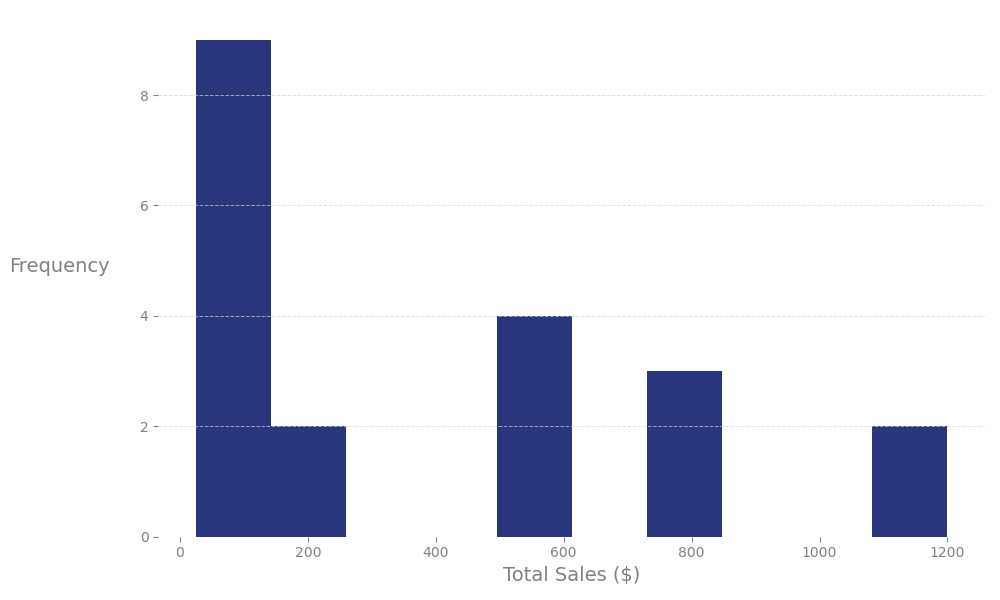
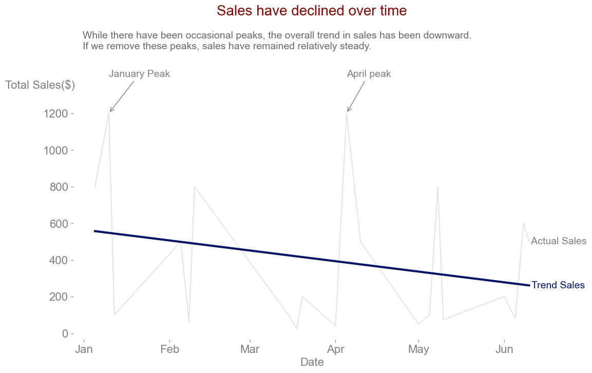
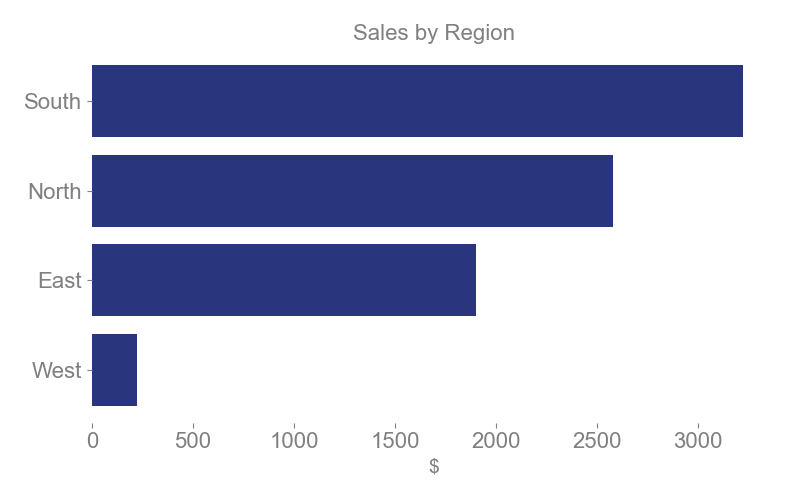
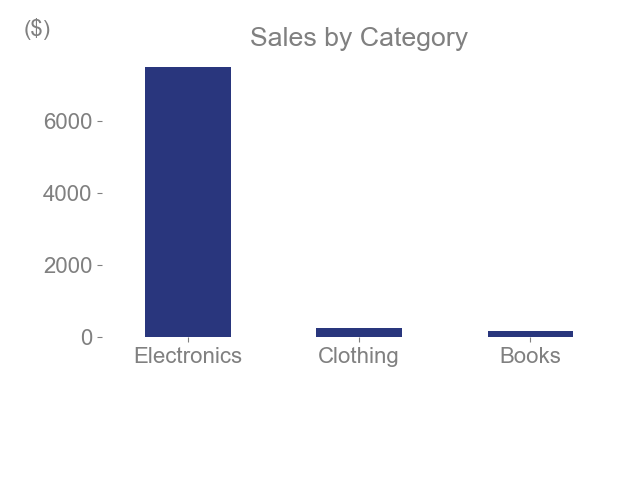

# Shop Ease Sales Data Analysis (Jan–Jun 2024)


**Overview**
---
This project presents a structured analysis of Shop Ease’s sales data from January to June 2024. The work includes data cleaning, exploratory analysis, and visualization to uncover key business insights. 
The analysis follows a clear, academic-inspired structure for readability and transparency.


**Table of Contents**
---
  - [Project Structure 📁](#project-structure-)
  - [Data Cleaning 🧹](#data-cleaning-)
  - [Exploratory Data Analysis - EDA 📊](#exploratory-data-analysis---eda-)
  - [Visualizations 📈](#visualizations-)
  - [Key Findings 🔑](#key-findings-)
  - [References 📚](#references-)
  


## Project Structure 📁

```text
ShopEase-Data-Analysis/
│
├── data/
│   ├── sales_data_raw.xlsx
│   |── sales_data_cleaned.xlsx
├── images/
│   ├── sales_by_region.png
│   ├── sales_by_category.png
│   |── sales.png
|   |── histogram.png
├── src/
│   └── Week1_Project_PyScript.py
README.md
```

## Data Cleaning 🧹

- Converted object data types to strings.
- Checked for duplicated rows (none found).
- Identified and filled missing values.
- Renamed the column `Total_Amount` to `Total_Sales`.
- Exported the cleaned dataset as `sales_data_cleaned.xlsx`.
- 
## Exploratory Data Analysis - EDA 📊

- **Mean Total Sales:** $396.5
- **Median Total Sales:** $200 (right-skewed distribution)
  
The median is significantly below the mean, indicating a right-skewed distribution. This skewness is due to two dates with exceptionally high sales (January 10 and April 5), as shown in the histogram with a pronounced right tail




|                | Date_ordinal | Quantity   | Price      | Total_Amount |
|----------------|--------------|------------|------------|--------------|
| Date_ordinal   | 1.000000     | 0.103176   | -0.189638  | -0.253372    |
| Quantity       | 0.103176     | 1.000000   | -0.423792  | -0.199315    |
| Price          | -0.189638    | -0.423792  | 1.000000   | 0.892401     |
| Total_Amount   | -0.253372    | -0.199315  | 0.892401   | 1.000000     |


**Correlation Analysis:** Strong positive correlation between Price and Total_Sales (as expected, since Total_Sales = Price × Quantity). Visual analysis shows a downward sales trend over time.
  


## Visualizations 📈









## Key Findings 🔑
- **Monthly Sales:** Highest in January ($2,100), second highest in April ($1,740), lowest in March ($325).
- **Sales Peaks:** January and April accounted for ~30% of total sales.
- **Overall Trend:** Downward sales trend across the period.
- **Category Performance:** Electronics dominated sales.
- **Regional Performance:** South region led in sales, West region had the lowest.


## References 📚
```
asana. (2025, January 21). Retrieved from https://asana.com/resources/business-requirements-document-template

IIBA. (2024, Novemeber 24). Retrieved from https://www.iiba.org/business-analysis-blogs/how-to-design-proper-reports/

University, C. M. (n.d.). Retrieved from https://www.stat.cmu.edu/~brian/701/notes/paper-structure.pdf
```
